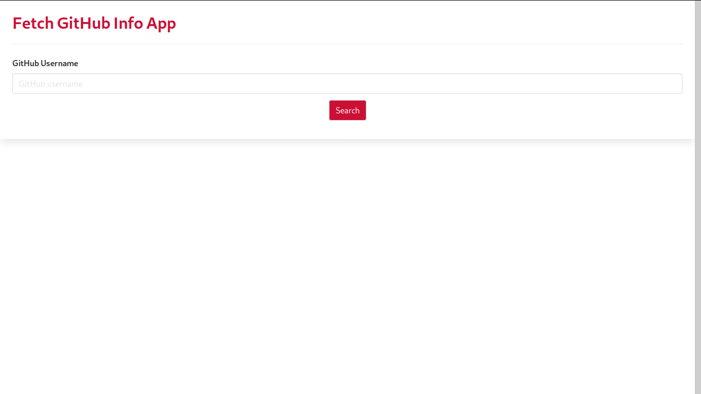

# Fetch-GitHub-Info
This is an Application that fetches the GitHub info of a particular GitHub user. It consumes the GitHub API v3

# Preview of the Application

# Extra packages
- Logrus (Logger for the console)- https://github.com/sirupsen/logrus
- Go-GitHub (for hitting the GitHub API) - https://github.com/google/go-github/
- Gorilla Mux (for routing) - https://github.com/gorilla/mux